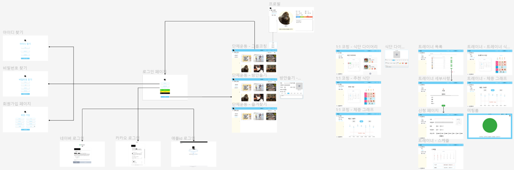
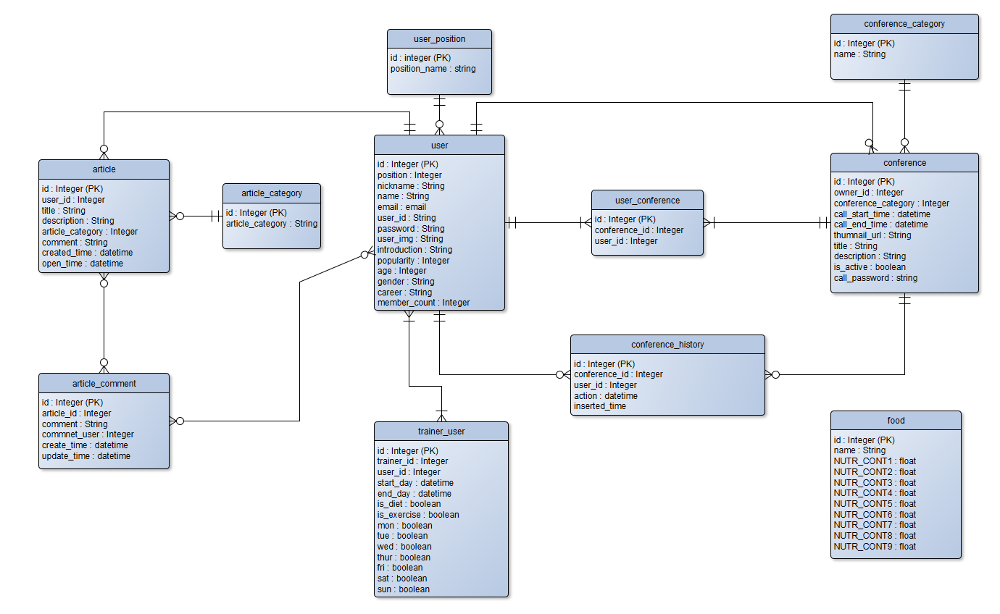
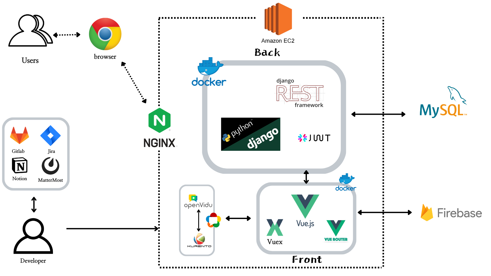

# NOW:N

### *온라인 운동 서비스 및 커뮤니티*

## 목차

[TOC]

## 팀원 소개

- 조경민 : 팀장, INFRA, Back, AI
- 박호현 : INFRA, BACK 
- 당현찬 : INFRA, BACK 
- 김학준 : Frpmt
- 박승주 : Front
- 안용현 : Front


## 프로젝트 개요

#### 프로젝트 기간

2022.07.06~2022.08.19

#### 와이어프레임



#### Git

##### - Git Flow

```
main
  └ Develop 
  	  ├ back
  	  |  └ km
  	  |  └ hohyun
  	  |  └ DHC
  	  └ front
  	     └ sj
  	     └ hj
  	     └ yonghyun
  	  
```

- main : 운영 서버로 배포하기 위한 브랜치

- Develop : 다음 버전을 위한 브랜치

- back : 백엔드 개발을 위한 브랜치

- front: 프론트엔드 개발을 위한 브랜치

- feature( km, hohyun, DHC, sj, hj, youghyun ) 

  - 세부 기능을 개발하는 브랜치 

  - 각자 담당한 기능들을 위한 브랜치 

##### - Commit Convention

- **feat:** 새로운 기능 추가 
- **fix:** 버그 픽스 
- **docs:** 문서 수정
- **style:** 포맷,  세미콜론 수정, Optimize import, Code clean up 등 코드가 아닌 스타일에 관련된 수정 
- **refactor:** 코드 리펙토링
- **test:** 테스트 코드 추가
- **chore:** 빌드 관련 업무 수정(안드로이드의 경우 builde.gradle, manifest)

#### DB 명세서

  [파일이 커서 링크로 대체합니다.](README.md.assets\DB_명세서.pdf) 

#### 기능 명세서

 [파일이 커서 링크로 대체합니다.](README.md.assets\기능_명세서.pdf) 

#### ERD



## 프로젝트 소개

#### 주요 기능

- 1:1 화상 코칭 서비스로 트레이너의 코칭을 받으면서 운동 할 수 있다. 

- 운동 하고 싶어하는 일반인들을 위한 커뮤니티를 통해 같이 운동하고 정보도 공유한다. 

- 체중 그래프를 통해 서비스를 이용한 기간 동안의 체중 변화를 알 수 있다. 

- 식단 다이어리를 기록하며 날짜별로 섭취한 칼로리를 측정 할 수 있다.

#### 프로젝트 특장점

- 직접 만나서 같이 운동을 하는 것에 비해 더 편리하다. 

- 정확한 칼로리 계산으로 식단관리를 제대로 할 수 있다. 

- 여러 사람들이 함께 운동하면 동기부여가 되서 더 열심히 운동 할 수 있다. 

- 트레이너에게 코칭을 받으면서 운동을 할 수 있기 때문에 운동을 잘 못하는 사람은 운동하는 방법을 배울 수 있다.  

- 트레이너는 더 간편하게 코칭하며 수익을 낼 수 있다.

#### 프로젝트 차별성

- object detection 기술을 통해 사진을 찍어 식단 다이어리를 작성하면 음식을 구분하고 칼로리를 계산한다.

#### 시스템 환경 및 구성도

1. 이슈 관리 : JIRA 

2. 형상 관리 : Gitlab 

3. 커뮤니케이션 : MatterMost, Notion, Discord, Webex 

4. 개발 환경 

   - OS : Window 10 

   - IDE Visual Studio Code 1.69 
   - UI/UX : Figma 
   - DB MySQL Workbench 8.0.29 
   - Server AWS EC2 

5. 개발 

   - Ubuntu 20.04.4 LTS 
   - Docker version 20.10.17
   - docker-compose version 1.29.2
   - nginx 1.18.0 
   - WebRTC
     - openvidu 2.20.0
   - DB
     - MySQL 8.0.30

   - Front-End 
     - Vue build file
     - HTML 5, CSS 3, JavaScript ES6 
     - Vue 3 
     - Vuex 3 
     - Node.js 16.14.2 
   - Back-End 
     - Python 3.9.12 
     - Django 3.2.13 



#### Server Port

| **이름** | 포트 |
| -------- | ---- |
| SSH      | 22   |
| HTTP     | 80   |
| HTTPS    | 443  |
| MySQL    | 3306 |
| Back     | 8000 |
| Front    | 8080 |
| openvidu | 8443 |


## 최종 산출물

URL : http://i7b108.p.ssafy.io/

<video src="../KakaoTalk_20220818_232513735.mp4"></video>