# NOW:N

### *온라인 운동 서비스 및 커뮤니티*

## 목차

[TOC]

## 팀원 소개

- 조경민 : 팀장, INFRA, Back, AI, UCC 출연
- 박호현 : INFRA, Back, WebRTC, UCC 출연
- 당현찬 : INFRA, Back, UCC 출연
- 김학준 : Front, UCC 출연
- 박승주 : Front, UCC 편집
- 안용현 :  UCC 출연


## 프로젝트 개요

#### 프로젝트 기간

2022.07.06~2022.08.19

#### 와이어프레임


#### Git

##### - Git Flow

```
main
  └ Develop 
  	  ├ back
  	  |  └ km
  	  |  └ hohyun
  	  |  └ DHC
  	  └ front
  	     └ sj
  	     └ hj
  	     └ yonghyun
  	  
```

- main : 운영 서버로 배포하기 위한 브랜치

- Develop : 다음 버전을 위한 브랜치

- back : 백엔드 개발을 위한 브랜치

- front: 프론트엔드 개발을 위한 브랜치

- feature( km, hohyun, DHC, sj, hj, youghyun ) 

  - 세부 기능을 개발하는 브랜치 

  - 각자 담당한 기능들을 위한 브랜치 

##### - Commit Convention

- **feat:** 새로운 기능 추가 
- **fix:** 버그 픽스 
- **docs:** 문서 수정
- **style:** 포맷,  세미콜론 수정, Optimize import, Code clean up 등 코드가 아닌 스타일에 관련된 수정 
- **refactor:** 코드 리펙토링
- **test:** 테스트 코드 추가
- **chore:** 빌드 관련 업무 수정(안드로이드의 경우 builde.gradle, manifest)

#### DB 명세서

  [파일이 커서 링크로 대체합니다.](README.md.assets\DB_명세서.pdf) 

#### 기능 명세서

 [파일이 커서 링크로 대체합니다.](README.md.assets\기능_명세서.pdf) 

#### ERD


## 프로젝트 소개

#### 주요 기능

- 1:1 화상 코칭 서비스로 트레이너의 코칭을 받으면서 운동 할 수 있다. 

- 운동 하고 싶어하는 일반인들을 위한 커뮤니티를 통해 같이 운동하고 정보도 공유한다. 

- 체중 그래프를 통해 서비스를 이용한 기간 동안의 체중 변화를 알 수 있다. 

- 식단 다이어리를 기록하며 날짜별로 섭취한 칼로리를 측정 할 수 있다.

#### 프로젝트 특장점

- 직접 만나서 같이 운동을 하는 것에 비해 더 편리하다. 

- 정확한 칼로리 계산으로 식단관리를 제대로 할 수 있다. 

- 여러 사람들이 함께 운동하면 동기부여가 되서 더 열심히 운동 할 수 있다. 

- 트레이너에게 코칭을 받으면서 운동을 할 수 있기 때문에 운동을 잘 못하는 사람은 운동하는 방법을 배울 수 있다.  

- 트레이너는 더 간편하게 코칭하며 수익을 낼 수 있다.

#### 프로젝트 차별성

- object detection 기술을 통해 사진을 찍어 식단 다이어리를 작성하면 음식을 구분하고 칼로리를 계산한다.

#### 시스템 환경 및 구성도

1. 이슈 관리 : JIRA 
2. 형상 관리 : Gitlab 
3. 커뮤니케이션 : MatterMost, Notion, Discord, Webex 
4. 개발 환경 

   - OS : Window 10 

   - IDE Visual Studio Code 1.69 
   - UI/UX : Figma 
   - DB MySQL Workbench 8.0.29 
   - Server AWS EC2 
5. 개발 

   - Ubuntu 20.04.4 LTS 
   - Docker version 20.10.17
   - docker-compose version 1.29.2
   - nginx 1.18.0 
   - WebRTC
     - openvidu 2.20.0
   - DB
     - MySQL 8.0.30
   - Front-End 
     - HTML 5, CSS 3, JavaScript ES6 
     - Vue 3 
     - Vuex 3 
     - Node.js 16.14.2 
   - Back-End 
     - Python 3.9.12 
     - Django 3.2.13 
     - Django Rest Framework 3.13.1


#### Server Port

| **이름** | 포트 |
| -------- | ---- |
| SSH      | 22   |
| HTTP     | 80   |
| HTTPS    | 443  |
| MySQL    | 3306 |
| Back     | 8000 |
| Front    | 8080 |
| openvidu | 8443 |

### 기능

1. 메인 홈 페이지

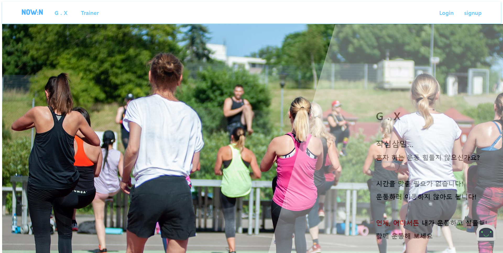

- 상단 네비게이션 바
  - 로고 클릭 시 홈 화면으로 이동
  - G.X 클릭 시 G.X 페이지로 이동
  - Trainer 클릭 시 Trainer 페이지로 이동
  - Login 클릭 시 로그인 페이지로 이동
  - SignUp 클릭 시 회원가입 페이지로 이동
- 페이지 내 G.X, P.X, Trainer 설명
  - 주요 기능, 페이지 설명과 함께 클릭 시 해당 페이지로 이동
- 알림 기능
  - 우 하단의 알림 봇을 통해 알림 수신 가능


- 로그인한 경우 Login, SignUp 버튼 대신 Profile, Logout 버튼
  - Profile 버튼 클릭 시 자신의 프로필 페이지로 이동
  - Logout 버튼 클릭 시 로그아웃

2. 로그인 페이지

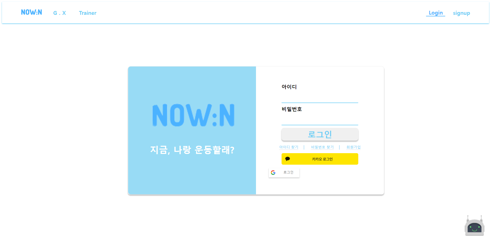

- 아이디, 비밀번호 입력 후 로그인버튼 클릭 시 해당 로그인 정보를 찾으면 로그인 성공 아니면 실패
- 카카오, 구글 등 소셜 로그인 기능
- 회원가입 버튼 클릭 시 회원가입 페이지로 이동

3. 회원가입 페이지

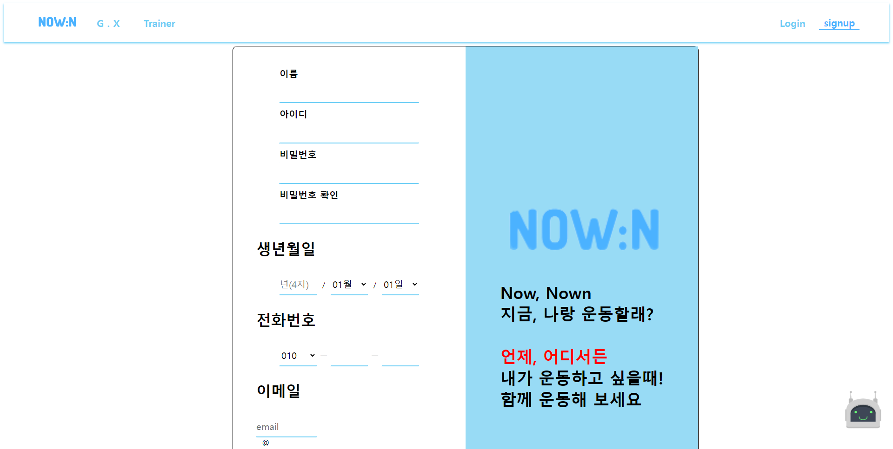

- 회원 필수 입력값 입력 후 회원가입 버튼 클릭 시 회원 가입 성공
  - 이름
  - 아이디
  - 비밀번호 (비밀번호 확인 기능 포함)
  - 생년월일
  - 전화번호
  - 이메일
  - 등급 (일반유저, 트레이너)

4. Profile 페이지


- 닉네임, 프로필 사진, 해시태그, 운동그래프, 팔로워 수, 팔로잉 수 데이터 조회
- 닉네임, 프로필 사진, 해시태그 데이터 수정

5. G.X - G.X Room

 

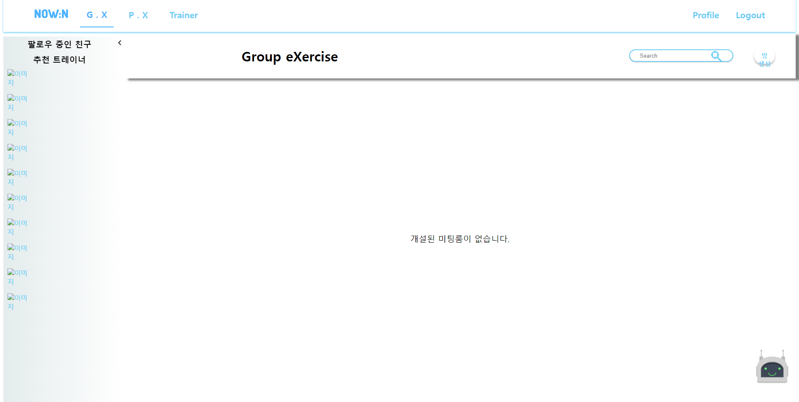

- 페이지 좌측 > 화살표 클릭 시 팔로우 바
  - 자신이 팔로우하고 있는 회원 목록
  - 팔로워 수가 많은 순서대로 회원 목록을 보여주는 팔로우할만 한 추천 회원 목록
- 개설되어있는 미팅룸 목록
- Search Bar를 통해 방장이름, 방 제목 등으로 미팅룸 검색
- 방 생성버튼 클릭 시 방 생성 페이지로 이동

6. G.X - G.X Room 방 생성

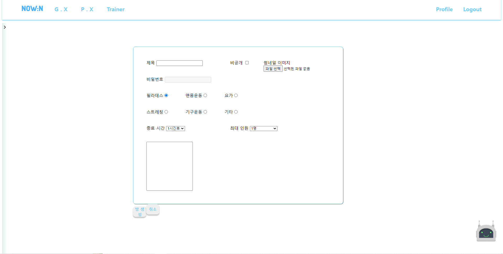

- 방 생성을 위한 데이터 입력 후 방 생성 버튼 클릭 시 방 생성
  - 제목
  - 공개/비공개 여부
  - G.X 룸 썸네일
  - 비밀번호 (비공개 선택 시)
  - 운동 카테고리
  - G.X 종료 시간
  - 최대 입장 인원
  - 방 설명

7. G.X - Community

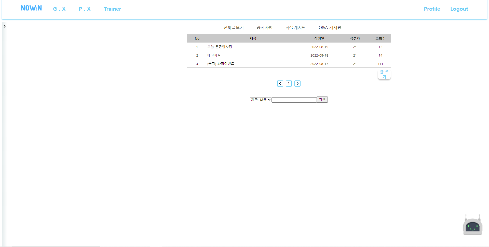

- 운영자 공지사항이나 G.X 미팅을 잡기위한 커뮤니티 공간

8. Trainer - 일반유저로 로그인한 경우

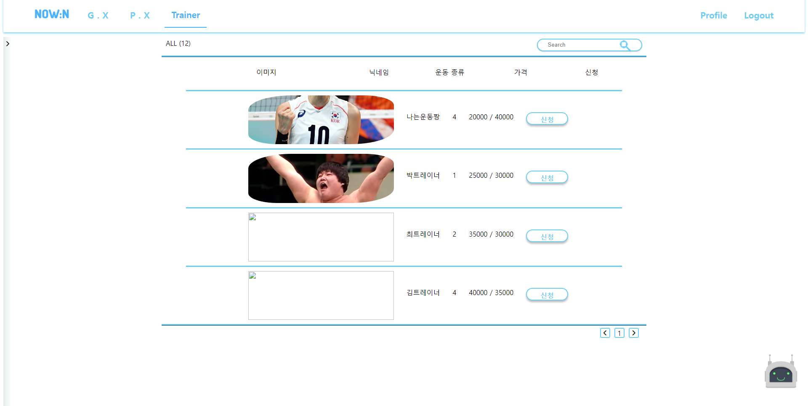

- 현재 NOW:N에 가입된 트레이너 목록 조회
- 해당 트레이너에게 상담 신청 기능
- 트레이너 닉네임으로 검색 기능

9. P.X - 일반유저로 로그인한 경우

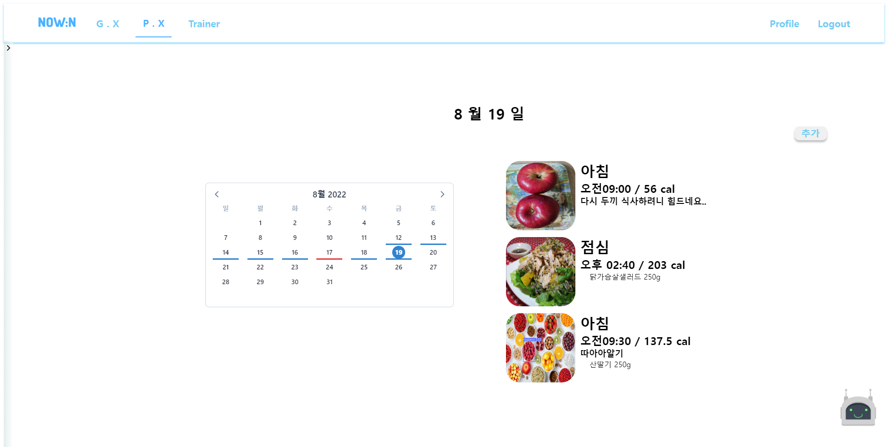

- 좌측 캘린더를 통해 해당 날짜 클릭 → 해당 날짜에 업로드한 자신의 식단 조회
- 추가 버튼을 통해 식단 추가 가능

10. P.X - Diet Diary 추가

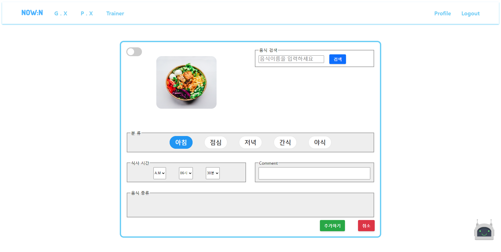

- 좌상단의 토글키로 AI모드 On/Off
  - AI 모드 On인 경우 식단 사진 업로드 시 해당 사진의 음식을 자동으로 찾아줌
- AI 모드를 Off해놨거나 음식 데이터를 직접 입력 추가하고 싶은 경우
  - 검색 바에 음식 이름 입력 시 해당하는 음식 데이터 목록 조회
  - 음식 데이터 목록 중 자신이 먹은 음식 클릭, 먹은 양 입력 후 추가
- 아침, 점심, 저녁, 간식, 야식 등 먹은 때를 입력
- 식사 시간, 별도 Comment 입력 후 추가하기 버튼 클릭하면 해당하는 식단 저장

11. P.X - 체중 그래프

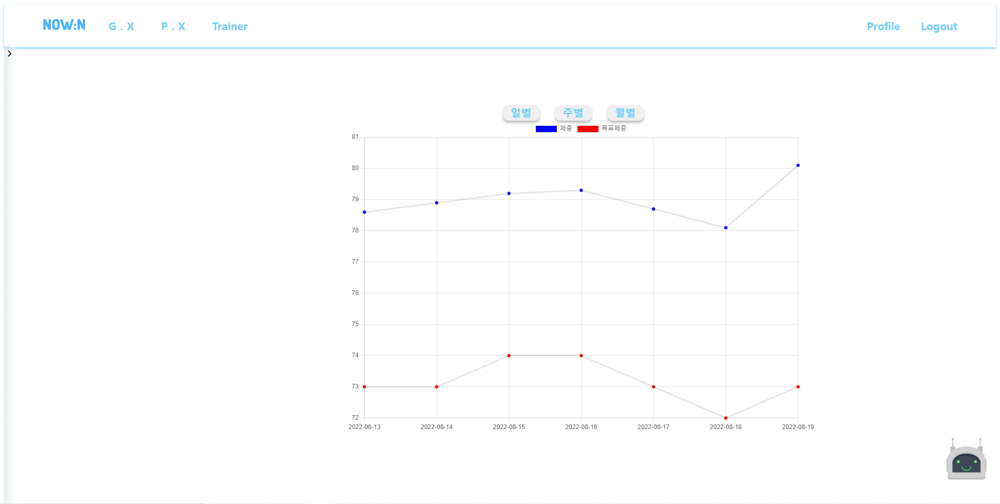

- 자신의 프로필 수정 시 입력한 목표체중, 체중을 일별, 주별, 월별로 7개씩 그래프 조회

12. P.X - 1:1 Coaching

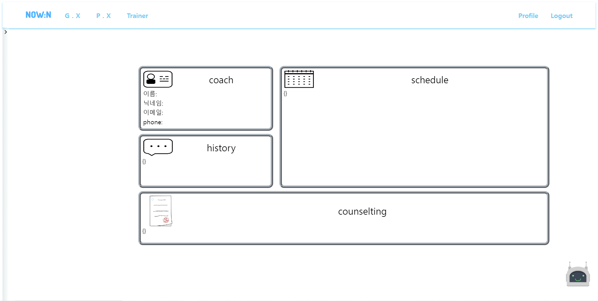

- 자신의 트레이너 정보, 트레이닝 이력, 현재 진행되고 있는 트레이닝의 스케줄, 상담 내역 조회

13. Consulting - 트레이너로 로그인한 경우


- 트레이너로 로그인한 경우 상단 Nav 바 - 일반유저의 경우 P.X → 트레이너의 경우 Consulting

14. Consulting - 상담 신청 관리

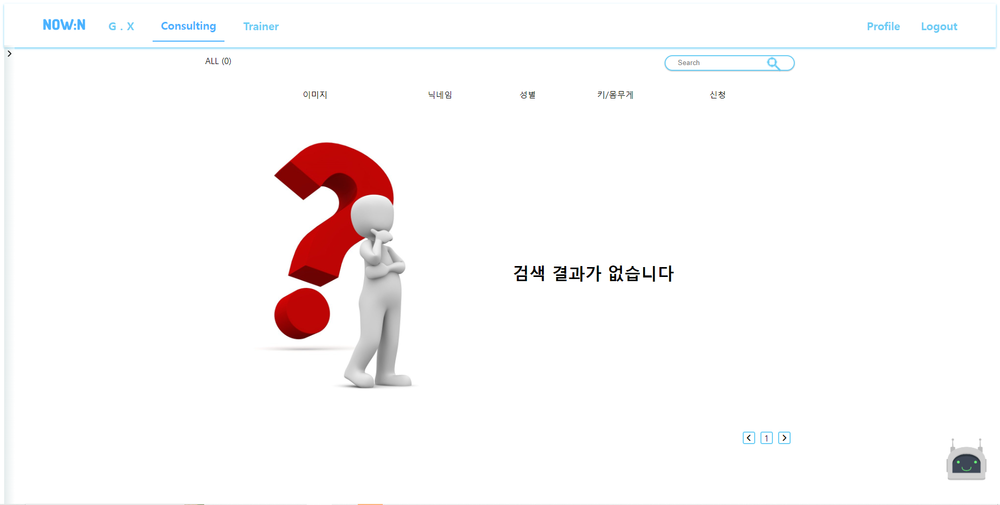

- 나에게 온 상담 신청자 목록 조회 → 수락, 거절 가능
- 상담자 이름으로 검색 가능
- 수락할 경우 → 상담 내역서 작성 후 트레이닝 관계 설정

15. Consulting - 내 회원 관리

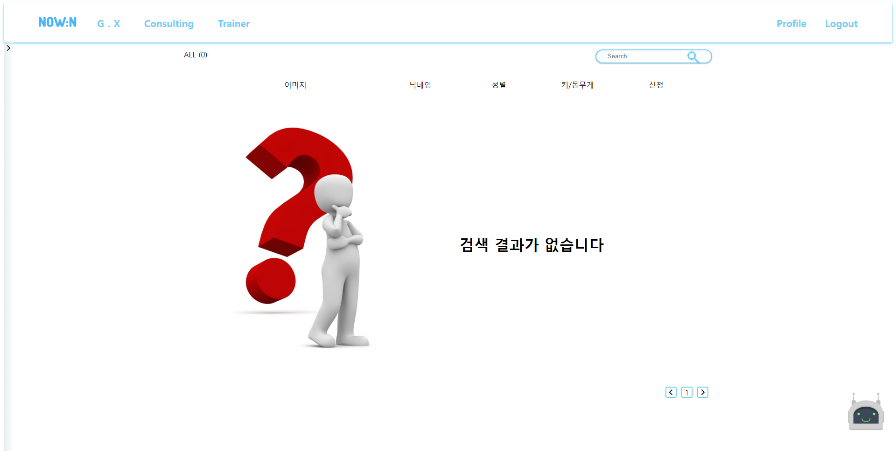

- 자신이 트레이닝 해주는 일반유저 목록
- 트레이닝 계약 당시 작성한 상담 내역 조회 가능

## 최종 산출물

URL : http://i7b108.p.ssafy.io/
